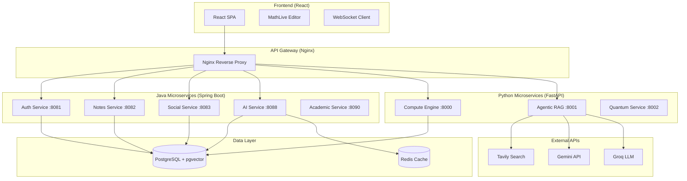
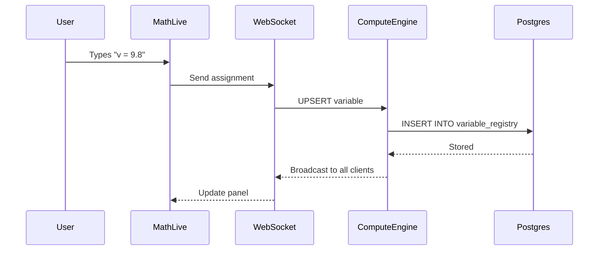
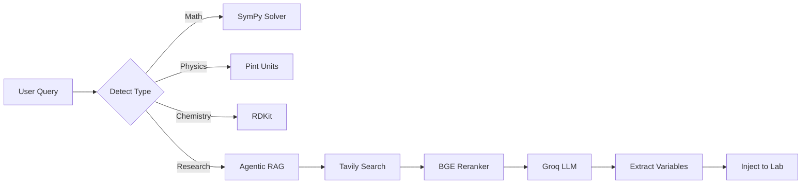
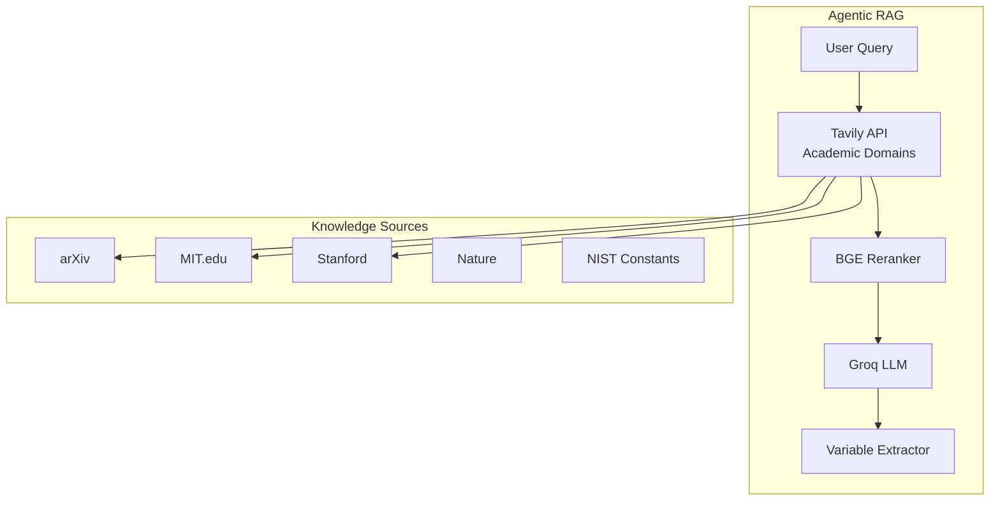

# ILAI Architecture Blueprint

## Executive Summary

**Verdict: Scalable Foundation with Optimization Opportunities**

| Metric | Status |
|--------|--------|
| Microservices | 9 services ✅ |
| API Protocols | REST + SSE + WebSocket ✅ |
| Database | pgvector/PostgreSQL ✅ |
| Variable Persistence | Postgres-backed ✅ |
| Code Execution | Sandbox available ⚠️ |
| CI/CD | BuildKit optimized ✅ |

---

## 1. Macro-Architecture (System Context)



### API Protocol Matrix

| Service | Protocol | Streaming |
|---------|----------|-----------|
| Auth | REST | No |
| Notes | REST | No |
| Social | REST | No |
| AI | REST | No |
| Compute Engine | REST + **WebSocket** | Yes (variables) |
| Agentic RAG | REST + **SSE** | Yes (search) |

---

## 2. Symbolic State Engine (Variable Registry)

### Current Implementation: ✅ **Persistent (Postgres-backed)**



### Key Files

| File | Purpose |
|------|---------|
| [repository.py](file:///c:/Users/prasanth/Desktop/muse-ilai/ilai-001/services/muse-compute-engine/repository.py) | Postgres CRUD |
| [websocket_handler.py](file:///c:/Users/prasanth/Desktop/muse-ilai/ilai-001/services/muse-compute-engine/websocket_handler.py) | Real-time sync |
| [useVariableSync.js](file:///c:/Users/prasanth/Desktop/muse-ilai/ilai-001/frontend/web/src/hooks/useVariableSync.js) | Frontend hook |

### Cross-Lab Sync

| Lab | Kernel | Variable Access |
|-----|--------|-----------------|
| Math | SymPy | Shared via Postgres |
| Physics | Pint (units) | Shared via Postgres |
| Chemistry | RDKit | Shared via Postgres |

---

## 3. AI & Computation Layer

### Query Flow



### Execution Security Analysis

| Component | Current State | Risk Level |
|-----------|---------------|------------|
| SymPy | Direct execution | ⚠️ Medium |
| RDKit | Direct execution | ⚠️ Medium |
| User Code | [sandbox.py](file:///c:/Users/prasanth/Desktop/muse-ilai/ilai-001/services/muse-compute-engine/sandbox.py) available | ✅ Low (if enabled) |

**Sandbox Config (when Docker available):**
- Memory: 256MB
- CPU: 0.5 cores
- Network: Disabled
- Timeout: 30s max

---

## 4. Global Neuro-Search Pipeline

### Integration Architecture



### Domain Filtering ([search.py](file:///c:/Users/prasanth/Desktop/muse-ilai/ilai-001/services/muse-agentic-rag/agent/search.py))

```python
ACADEMIC_DOMAINS = [
    "arxiv.org", "mit.edu", "stanford.edu",
    "nature.com", "ieee.org", "acm.org"
]
```

---

## 5. DevOps & CI/CD Analysis

### Current State (Post-Optimization)

| Metric | Before | After |
|--------|--------|-------|
| Build Time | 20min | ~5min (cached) |
| Image Size | 10GB | ~2GB |
| Multi-stage | ❌ | ✅ |
| BuildKit | ❌ | ✅ |
| .dockerignore | Partial | ✅ Complete |

### Optimizations Applied

1. **Multi-stage Python Dockerfiles** - Builder → Slim runtime
2. **BuildKit caching** - `cache-from: type=gha`
3. **Service-level .dockerignore** - Excludes __pycache__, venv
4. **Image size metrics** - Output in CI logs

---

## 6. Gap Analysis Table

| Component | Current Logic | Sophisticated Target | Priority |
|-----------|---------------|---------------------|----------|
| **Variable Sync** | WebSocket + Postgres ✅ | Add Redis pub/sub for multi-node | Low |
| **Code Execution** | Sandbox available | Enable Docker-in-Docker for CI | Medium |
| **Reranking** | Keyword-based fallback | sentence-transformers (large) | Low (trade-off) |
| **Vector Search** | pgvector available | Implement note embeddings | High |
| **Multi-hop RAG** | 3 hops max | Dynamic hop count based on quality | Medium |
| **Build Time** | ~5min cached | <2min with layer pruning | Low |
| **Image Size** | ~2GB Python | <500MB (requires API-only) | Trade-off |
| **gRPC** | Not used | Consider for inter-service | Future |
| **Rate Limiting** | Not implemented | Add to Nginx/Kong | High |
| **Monitoring** | Basic health checks | Prometheus + Grafana | Medium |

---

## 7. Architecture Scorecard

| Aspect | Score | Notes |
|--------|-------|-------|
| **Scalability** | 8/10 | Microservices + stateless APIs |
| **Persistence** | 9/10 | Postgres + Redis + pgvector |
| **Security** | 7/10 | JWT auth, sandbox available |
| **Observability** | 5/10 | Health checks only |
| **CI/CD** | 8/10 | BuildKit, parallel jobs |
| **Code Quality** | 7/10 | Modular, typed APIs |

**Overall: Solid Foundation for Scale** 🚀
