# ILAI Architecture Blueprint — Deep Functional Reference

**Version:** 2.0  
**Last Updated:** December 2024  
**Status:** Production-Ready with Phase 3 Enhancements

---

## Executive Summary

| Metric | Current State |
|--------|---------------|
| **Microservices** | 9 services (5 Java + 3 Python + 1 Frontend) |
| **API Protocols** | REST + SSE + WebSocket + STOMP |
| **Database** | PostgreSQL + pgvector + Redis |
| **AI Integration** | Gemini + Groq + Bedrock (planned) |
| **Pricing Tiers** | Free / General (₹199) / Pro (₹399) / PhD (₹699) |
| **Real-time Sync** | WebSocket with Vector Clock CRDT |
| **CI/CD** | GitHub Actions + Docker + GHCR |

---

## 1. System Architecture

### 1.1 High-Level Topology


---

## 2. Service Deep Dive

### 2.1 muse-auth-service (Port 8081)

**Stack:** Spring Boot 3.5.7 + Spring Security + JJWT

#### Entities
| Entity | Description |
|--------|-------------|
| `User` | Core user with email, password, role |
| `Profile` | Extended user info (avatar, bio) |
| `Institution` | Schools, colleges, organizations |
| `Follow` | User-to-user follow relationships |
| `RefreshToken` | JWT refresh token storage |
| `VerificationToken` | Email/phone verification |

#### Controllers (52 files)
| Controller | Endpoints | Description |
|------------|-----------|-------------|
| `AuthController` | `/api/auth/*` | Login, register, refresh, logout |
| `AccountController` | `/api/account/*` | Profile, password change, delete |
| `UserController` | `/api/users/*` | User search, public profiles |
| `FollowController` | `/api/follows/*` | Follow, unfollow, followers list |
| `ParentController` | `/api/parent/*` | Parent dashboard, child linking |
| `InstitutionController` | `/api/institutions/*` | School management |

#### Authentication Flow


#### Roles & Permissions
| Role | Capabilities |
|------|-------------|
| `STUDENT` | Notes, Journal, Feed, Labs |
| `TEACHER` | + Assignments, Grading |
| `PARENT` | + Child monitoring |
| `ADMIN` | Full system access |

---

### 2.2 muse-notes-service (Port 8082)

**Stack:** Spring Boot 3.5.7 + JPA + WebSocket

#### Entities (82 files)
| Entity | Description |
|--------|-------------|
| `Notebook` | Container for notes (like folders) |
| `Section` | Chapters within notebooks |
| `Note` | Rich text content (JSON blocks) |
| `NoteVersion` | Version history for undo |
| `NoteLink` | Bi-directional note linking |
| `SharedNote` | Sharing permissions |
| `Template` | Note templates |
| `Attachment` | File attachments |
| `CalendarEvent` | Integrated calendar |

#### Journal Subsystem
| Entity | Description |
|--------|-------------|
| `Journal` | Personal journal container |
| `JournalEntry` | Daily entries with mood |
| `Gratitude` | Gratitude prompts |
| `JournalAudio` | Voice memo attachments |
| `JournalPublication` | Published entries |

#### Controllers
| Controller | Endpoints | Description |
|------------|-----------|-------------|
| `NoteController` | `/api/notes/*` | CRUD, search, trash |
| `NotebookController` | `/api/notebooks/*` | Notebook management |
| `ShareController` | `/api/shares/*` | Share links, permissions |
| `TemplateController` | `/api/templates/*` | Note templates |
| `JournalController` | `/api/journals/*` | Journal entries |
| `CalendarController` | `/api/calendar/*` | Events, reminders |
| `AiController` | `/api/notes/ai/*` | AI summarization |
| `LabPersistentSaveController` | `/api/lab-saves/*` | Save Lab state to notes |

#### Note Content Structure
```json
{
  "id": 123,
  "title": "Physics Constants",
  "content": {
    "type": "doc",
    "content": [
      {"type": "heading", "content": [{"text": "Gravitational Constant"}]},
      {"type": "paragraph", "content": [{"text": "G = 6.674×10⁻¹¹ N⋅m²/kg²"}]},
      {"type": "codeBlock", "attrs": {"language": "latex"}, "content": [{"text": "F = G\\frac{m_1 m_2}{r^2}"}]}
    ]
  },
  "tags": ["physics", "constants"],
  "linkedNoteIds": [124, 125]
}
```

---

### 2.3 muse-social-service (Port 8083)

**Stack:** Spring Boot 3.5.7 + WebSocket + Stripe + Redis

#### Module Architecture
```
muse-social-service/
├── billing/           # Stripe subscription & metered billing
│   ├── entity/        # UserSubscription, TokenUsage
│   ├── service/       # TokenUsageService, FeatureFlagService
│   └── controller/    # StripeWebhookController
├── bounty/            # BountyBoard problem solving
│   ├── entity/        # Bounty, BountyAttempt
│   ├── service/       # BountyService
│   └── controller/    # BountyController
├── reputation/        # Gamification & points
│   ├── entity/        # UserReputation
│   └── service/       # ReputationService
├── warroom/           # Study War Rooms
│   ├── entity/        # StudyRoom, RoomVariable
│   ├── handler/       # WarRoomWebSocketHandler
│   └── service/       # WarRoomService
├── chat/              # Real-time messaging
│   ├── controller/    # ChatController, VideoSignalingController
│   └── service/       # ChatService
└── feed/              # Social feed & posts
    ├── entity/        # Post, Comment, Reaction, StudyGroup
    └── controller/    # PostController, GroupController
```

#### Pricing Tiers
| Tier | Price | Features |
|------|-------|----------|
| **Free** | ₹0 | Notes, Feed (read), Basic chat |
| **General** | ₹199/mo | + Bounties, Groups, AI basic |
| **Pro** | ₹399/mo | + Labs, War Rooms, AI advanced |
| **PhD** | ₹699/mo | + Research AI, Paper Graph, Unlimited |

#### Feature Flags (Redis-backed)
```java
TIER_FEATURES = {
    "free": ["notes", "feed_read", "chat_basic"],
    "general": ["notes", "feed", "chat", "bounties", "ai_assist_basic"],
    "pro": ["labs", "war_rooms", "ai_assist_advanced"],
    "phd": ["ai_research", "paper_graph", "bedrock_claude", "unlimited_compute"]
}
```

#### BountyBoard Flow

```mermaid
sequenceDiagram
    participant Creator
    participant BountyService
    participant NotesService
    participant Solver
    participant ReputationService
    
    Creator->>BountyService: POST /api/bounties (linkedNoteId)
    BountyService->>NotesService: Validate note exists
    BountyService->>ReputationService: Deduct 5 points
    BountyService-->>Creator: Bounty created
    
    Solver->>BountyService: POST /api/bounties/{id}/attempts
    BountyService-->>Solver: Attempt recorded
    
    Creator->>BountyService: Accept solution
    BountyService->>ReputationService: Award 50+ points to solver
    BountyService->>NotesService: Link problem ↔ solution notes
```


---

### 2.4 muse-ai-service (Port 8088)

**Stack:** Spring Boot 3.5.7 + WebClient + SSE + Redis

#### AI Capabilities (93 files)
| Feature | Description |
|---------|-------------|
| **Doubt Solver** | Step-by-step problem solving |
| **Study Search** | Semantic search across notes |
| **Flashcards** | Auto-generated from notes |
| **Research Agent** | Multi-source research synthesis |
| **Personalization** | Learning style adaptation |
| **Voice** | Speech-to-text transcription |
| **Gamification** | Achievements, streaks, leaderboards |

#### Agent Architecture


#### Automation Engine
| Automation | Trigger | Action |
|------------|---------|--------|
| `NoteAutomation` | Note saved | Generate summary, suggest links |
| `JournalAutomation` | Entry created | Mood analysis, gratitude prompts |
| `FeedAutomation` | Trending topic | Personalized feed curation |
| `ClassroomAutomation` | Assignment due | Reminder notifications |
| `ChatCalendarAutomation` | Date mentioned | Create calendar event |

#### LLM Configuration
```yaml
# Gemini (Primary)
gemini:
  model: gemini-1.5-flash
  maxTokens: 8192
  
# Groq (Fast inference)
groq:
  model: llama-3.1-70b-versatile
  maxTokens: 4096
```

---

### 2.5 muse-compute-engine (Port 8000)

**Stack:** FastAPI + SymPy + Pint + RDKit + WebSocket

#### File Structure
| File | Purpose |
|------|---------|
| `main.py` | FastAPI app, unified solver endpoint |
| `repository.py` | Postgres variable persistence |
| `websocket_handler.py` | Real-time variable broadcast |
| `sandbox.py` | Secure code execution (Docker) |
| `rate_limiter.py` | Redis-based rate limiting |
| `kernels/physics.py` | Pint unit conversion |
| `kernels/chemistry.py` | RDKit molecule analysis |

#### Unified Solver API
```python
POST /api/solver/solve
{
    "expression": "diff(x^2 + 3*x, x)",
    "variables": {"a": 5},
    "user_id": "123",
    "subject": "math"  # math | physics | chemistry
}

Response:
{
    "success": true,
    "result": "2*x + 3",
    "result_latex": "2x + 3",
    "steps": ["Differentiate x^2 → 2x", "Differentiate 3x → 3"],
    "derivation_latex": "\\frac{d}{dx}(x^2 + 3x) = 2x + 3"
}
```

#### Subject Kernels
| Kernel | Library | Capabilities |
|--------|---------|--------------|
| **Math** | SymPy | Algebra, calculus, linear algebra |
| **Physics** | Pint | Unit conversion, dimensional analysis |
| **Chemistry** | RDKit | SMILES parsing, molecular properties |

#### WebSocket Variable Sync

```mermaid
sequenceDiagram
    participant User1
    participant WebSocket
    participant ComputeEngine
    participant Postgres
    participant User2
    
    User1->>WebSocket: Set v = 9.8 m/s²
    WebSocket->>ComputeEngine: UPSERT variable
    ComputeEngine->>Postgres: INSERT INTO room_variables
    ComputeEngine->>WebSocket: Broadcast to room
    WebSocket->>User2: Variable updated
```


---

### 2.6 muse-agentic-rag (Port 8001)

**Stack:** FastAPI + LangGraph + Tavily + BGE Reranker

#### Research Pipeline


#### LangGraph Agent State
```python
class AgentState(TypedDict):
    query: str
    search_results: List[SearchResult]
    reranked_results: List[SearchResult]
    synthesis: str
    extracted_variables: List[Variable]
    thinking_log: List[str]
    hop_count: int  # Multi-hop depth
```

#### Physical Constants Injection
```python
POST /api/constants/inject
{
    "symbol": "G",
    "user_id": "123"
}

# Broadcasts via WebSocket:
{
    "type": "constant_injected",
    "symbol": "G",
    "name": "Gravitational constant",
    "value": 6.67430e-11,
    "unit": "N⋅m²/kg²"
}
```

---

### 2.7 muse-academic-service (Port 8090)

**Stack:** Spring Boot 3.5.7 + JPA

#### Entities
| Entity | Description |
|--------|-------------|
| `Classroom` | Virtual classrooms |
| `Assignment` | Homework, projects |
| `Submission` | Student submissions |
| `Grade` | Grading records |
| `Club` | Student organizations |
| `Announcement` | Class announcements |

---

## 3. Frontend Architecture

### 3.1 Tech Stack
- **Framework:** React 18 + Vite
- **Routing:** React Router v6
- **State:** Context + Hooks
- **Styling:** Tailwind CSS + Glassmorphism
- **Math:** MathLive + KaTeX
- **Charts:** Plotly.js
- **3D:** Three.js (molecules)

### 3.2 Page Inventory (62 pages)

#### Core Modules
| Page | Route | Description |
|------|-------|-------------|
| `auth.jsx` | `/login`, `/register` | Authentication |
| `home.jsx` | `/` | Dashboard |
| `NotesHome.jsx` | `/notes` | Note management |
| `JournalHome.jsx` | `/journal` | Personal journal |
| `FeedPage.jsx` | `/feed` | Social feed |
| `Chat.jsx` | `/chat` | Messaging |

#### Labs Module
| Page | Route | Description |
|------|-------|-------------|
| `ResearchLab.jsx` | `/labs` | Unified solver + research |
| `UniversalEngine.jsx` | `/engine` | Free-form computation |
| `DeepResearch.jsx` | `/research` | AI research agent |

#### User Features
| Page | Route | Description |
|------|-------|-------------|
| `Profile.jsx` | `/profile` | User profile |
| `MyAccount.jsx` | `/account` | Settings |
| `Pricing.jsx` | `/pricing` | Subscription tiers |
| `Checkout.jsx` | `/checkout` | Stripe payment |

#### Academic
| Page | Route | Description |
|------|-------|-------------|
| `TeacherDashboard.jsx` | `/teacher` | Teacher tools |
| `ParentDashboard.jsx` | `/parent` | Parent monitoring |
| `Quiz.jsx` | `/quiz` | Practice quizzes |
| `FlashcardsPage.jsx` | `/flashcards` | Spaced repetition |

### 3.3 Component Hierarchy
```
App
├── Layout
│   ├── Sidebar
│   ├── TopNav
│   └── MainContent
├── Notes
│   ├── NotebookList
│   ├── NoteEditor (RichNoteEditor)
│   └── AIToolsPanel
├── Labs
│   ├── ExpressionInput (MathLive)
│   ├── VariableRegistry
│   ├── ResultDisplay
│   │   ├── Visualizer (Plotly)
│   │   └── MoleculeViewer (Three.js)
│   └── ResearchPanel
└── Social
    ├── PostCard
    ├── CommentSection
    └── GroupList
```

---

## 4. Database Schema

### 4.1 PostgreSQL Tables (Core)

#### Auth Database
| Table | Rows Est. | Description |
|-------|-----------|-------------|
| `users` | 10K+ | User accounts |
| `profiles` | 10K+ | Extended user info |
| `refresh_tokens` | 50K+ | JWT refresh tokens |
| `verification_tokens` | 5K+ | Email/phone verification |
| `follows` | 100K+ | Follow relationships |
| `institutions` | 100+ | Schools, colleges |

#### Notes Database
| Table | Rows Est. | Description |
|-------|-----------|-------------|
| `notebooks` | 50K+ | Note containers |
| `sections` | 100K+ | Chapters |
| `notes` | 500K+ | Note content (JSONB) |
| `note_versions` | 2M+ | Version history |
| `note_links` | 200K+ | Bi-directional links |
| `attachments` | 100K+ | Files |
| `templates` | 1K+ | Note templates |
| `journals` | 20K+ | Journal containers |
| `journal_entries` | 200K+ | Daily entries |
| `calendar_events` | 100K+ | Integrated calendar |

#### Social Database
| Table | Rows Est. | Description |
|-------|-----------|-------------|
| `user_subscriptions` | 10K+ | Stripe subscriptions |
| `token_usage` | 50K+ | AI token tracking |
| `user_reputation` | 10K+ | Gamification scores |
| `reputation_history` | 500K+ | Points audit trail |
| `bounties` | 10K+ | Problem bounties |
| `bounty_attempts` | 50K+ | Solution attempts |
| `posts` | 100K+ | Social posts |
| `comments` | 500K+ | Post comments |
| `reactions` | 1M+ | Likes, reactions |
| `study_rooms` | 5K+ | War rooms |
| `room_variables` | 100K+ | Synced variables |
| `conversations` | 50K+ | Chat threads |
| `messages` | 1M+ | Chat messages |

### 4.2 pgvector Embeddings

| Table | Column | Dimensions | Index |
|-------|--------|------------|-------|
| `user_reputation` | `interest_embedding` | 1536 | HNSW |
| `research_papers` | `embedding` | 1536 | HNSW |
| `note_embeddings` | `embedding` | 1536 | HNSW |

---

## 5. API Reference

### 5.1 Authentication
```
POST   /api/auth/register        # Create account
POST   /api/auth/login           # Login → JWT
POST   /api/auth/refresh         # Refresh access token
POST   /api/auth/logout          # Invalidate tokens
GET    /api/auth/me              # Current user
```

### 5.2 Notes
```
GET    /api/notebooks            # List notebooks
POST   /api/notebooks            # Create notebook
GET    /api/notes                # List notes
POST   /api/notes                # Create note
PUT    /api/notes/{id}           # Update note
DELETE /api/notes/{id}           # Delete (trash)
POST   /api/notes/{id}/link      # Link notes
```

### 5.3 Social
```
GET    /api/bounties             # List bounties
POST   /api/bounties             # Create bounty
POST   /api/bounties/{id}/attempts  # Submit solution
POST   /api/bounties/{id}/attempts/{aid}/accept  # Accept
GET    /api/posts                # Feed
POST   /api/posts                # Create post
POST   /api/posts/{id}/react     # React
GET    /api/groups               # Study groups
```

### 5.4 Labs (Compute Engine)
```
POST   /api/solver/solve         # Unified solver
GET    /api/constants            # Physical constants
POST   /api/constants/inject     # Inject to registry
WS     /ws/variables             # Real-time sync
```

### 5.5 AI
```
POST   /api/ai/doubt             # Doubt solver
POST   /api/ai/flashcards        # Generate flashcards
POST   /api/ai/summarize         # Note summary
GET    /api/ai/search            # Semantic search
POST   /api/research/query       # Research agent
```

### 5.6 Billing
```
POST   /api/webhooks/stripe      # Stripe webhooks
GET    /api/bounties/usage       # Token usage
GET    /api/features             # User features
```

---

## 6. Deployment Architecture

### 6.1 AWS Infrastructure


### 6.2 Cost Estimates (1,000 users)

| Resource | Phase 1 | Phase 2 | Phase 3 |
|----------|---------|---------|---------|
| Aurora Serverless | $30/mo | $50/mo | $80/mo |
| ECS Fargate | $45/mo | $100/mo | $150/mo |
| ElastiCache | $15/mo | $25/mo | $40/mo |
| CloudFront | $5/mo | $10/mo | $20/mo |
| Secrets Manager | $5/mo | $5/mo | $5/mo |
| Bedrock (AI) | $0 | $0 | $150/mo |
| **Total** | **$100/mo** | **$190/mo** | **$445/mo** |

---

## 7. Security Architecture

### 7.1 Authentication Flow
```
JWT Access Token (15 min) → Stored in memory
JWT Refresh Token (7 days) → HttpOnly cookie + Redis
```

### 7.2 Authorization
| Layer | Mechanism |
|-------|-----------|
| API Gateway | Rate limiting, CORS |
| Spring Security | JWT validation |
| Feature Flags | Tier-based access (Redis) |
| Database | Row-level security (user_id) |

### 7.3 Sandbox Execution
```python
# Docker sandbox for user code
sandbox_config = {
    "memory": "256MB",
    "cpu": 0.5,
    "network": "none",
    "timeout": 30,
    "read_only_root": True
}
```

---

## 8. Monitoring & Observability

### 8.1 Health Endpoints
| Service | Endpoint |
|---------|----------|
| All Java | `/actuator/health` |
| Compute Engine | `/health` |
| Agentic RAG | `/health` |

### 8.2 Metrics (Planned)
| Metric | Source |
|--------|--------|
| Request latency | CloudWatch |
| Error rate | CloudWatch Logs |
| Token usage | Redis + Stripe |
| Active users | WebSocket connections |
| DB connections | Aurora metrics |

---

## 9. Architecture Scorecard

| Aspect | Score | Notes |
|--------|-------|-------|
| **Scalability** | 9/10 | Microservices + Fargate + Aurora Serverless |
| **Persistence** | 9/10 | Postgres + pgvector + Redis |
| **Real-time** | 9/10 | WebSocket + CRDT + STOMP |
| **Security** | 8/10 | JWT + Feature flags + Sandbox |
| **AI Integration** | 9/10 | Multi-LLM + Agentic RAG |
| **Billing** | 8/10 | Stripe + Metered usage |
| **Observability** | 6/10 | Health checks, needs Prometheus |
| **CI/CD** | 8/10 | GitHub Actions + GHCR |
| **Code Quality** | 8/10 | Modular, typed APIs |

**Overall: Production-Ready Platform** 🚀

---

## 10. Future Enhancements

| Feature | Phase | Priority |
|---------|-------|----------|
| Prometheus + Grafana | Phase 2 | High |
| gRPC inter-service | Phase 3 | Medium |
| Multi-region deployment | Phase 3 | Medium |
| Mobile apps (React Native) | Phase 3 | High |
| Voice-first interface | Phase 3 | Medium |
| Collaborative editing (CRDT) | Phase 2 | Medium |
| Graph DB for knowledge | Phase 3 | Low |
