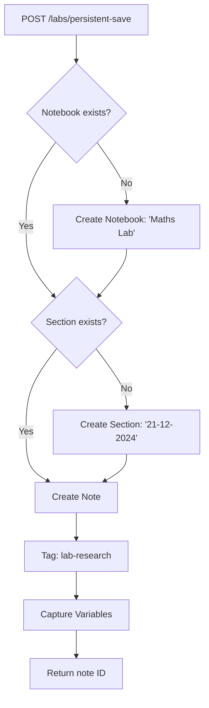

# Symbolic Solver & Note Archiver Implementation

## Overview

| Feature | Component | API |
|---------|-----------|-----|
| MathLive → Solver | Frontend | POST `/api/solver/solve` |
| Save to Workspace | Frontend + Backend | POST `/api/notes/labs/persistent-save` |
| Auto-Path Generator | Backend | Creates `/[Subject] Lab/[Date]/[Topic]` |

---

## 1. Frontend: MathLive → Solver Connection

### [MODIFY] [ResearchLab.jsx](file:///c:/Users/prasanth/Desktop/muse-ilai/ilai-001/frontend/web/src/pages/Labs/ResearchLab.jsx)

**Changes:**
1. Add `onKeyDown` handler to MathField for Enter key
2. Call `/api/solver/solve` with LaTeX string
3. Stream result to KaTeX output panel

```jsx
// On Enter key in MathLive
const handleMathInput = async (latex) => {
    const response = await fetch(`${COMPUTE_URL}/api/solver/solve`, {
        method: 'POST',
        body: JSON.stringify({ expression: latex, variables: wsVariables })
    });
    const result = await response.json();
    // Update result panel with symbolic solution
};
```

---

## 2. Frontend: "Save to Workspace" Button

### [MODIFY] [ResearchLab.jsx](file:///c:/Users/prasanth/Desktop/muse-ilai/ilai-001/frontend/web/src/pages/Labs/ResearchLab.jsx)

**New State:**
```jsx
const [isSaving, setIsSaving] = useState(false);
const [saveSuccess, setSaveSuccess] = useState(false);
```

**Auto-Path Logic:**
```jsx
const generateAutoPath = (subject = 'Maths') => {
    const today = new Date();
    const dateStr = today.toLocaleDateString('en-GB').replace(/\//g, '-');
    // Returns: { notebook: "Maths Lab", section: "21-12-2024", title: "Research" }
    return { notebook: `${subject} Lab`, section: dateStr, title: 'Research Session' };
};
```

**Save Payload:**
```jsx
const savePayload = {
    autoPath: generateAutoPath(activeSubject),
    equation: currentExpression,
    solution: currentResult,
    variables: Object.fromEntries(wsVariables.map(v => [v.symbol, v.value])),
    researchResults: searchResults,
    sources: sources
};
```

---

## 3. Backend: Persistent Save Endpoint

### [NEW] LabPersistentSaveController.java

**Path:** `services/muse-notes-service/src/main/java/com/muse/notes/controller/`

**Endpoint:** `POST /api/notes/labs/persistent-save`

**Logic:**
1. Extract `userId` from JWT
2. Find or create Notebook (e.g., "Maths Lab")
3. Find or create Section (e.g., "21-12-2024")
4. Create Note with structured content
5. Tag as "lab-research" for pgvector search
6. Capture variable registry state

### [NEW] LabPersistentSaveRequest.java

```java
public class LabPersistentSaveRequest {
    private AutoPath autoPath;
    private String equation;
    private String solution;
    private Map<String, Object> variables;
    private String researchResults;
    private List<Source> sources;
    
    public static class AutoPath {
        private String notebook;
        private String section;
        private String title;
    }
}
```

---

## 4. Directory Handling Flow



---

## 5. File Changes Summary

| File | Action | Description |
|------|--------|-------------|
| `ResearchLab.jsx` | MODIFY | Add Enter handler, Save button, auto-path |
| `LabPersistentSaveController.java` | NEW | `/labs/persistent-save` endpoint |
| `LabPersistentSaveRequest.java` | NEW | Request DTO |
| `NotebookService.java` | MODIFY | Add `findOrCreateByName()` |
| `SectionService.java` | MODIFY | Add `findOrCreateByName()` |

---

## 6. Variable Sync Capture

The save payload includes the current variable registry state:

```json
{
    "variables": {
        "x": 5,
        "v": 9.8,
        "m": 2.5
    }
}
```

This is stored in the Note's `metadata` field as JSON, making it "live" - when reopened, variables can be restored.

---

## Implementation Order

1. [ ] Backend: Create `LabPersistentSaveRequest` DTO
2. [ ] Backend: Create `LabPersistentSaveController`
3. [ ] Backend: Add `findOrCreateByName` to services
4. [ ] Frontend: Add Save button to ResearchLab
5. [ ] Frontend: Implement auto-path generator
6. [ ] Frontend: Connect save to backend API
7. [ ] Test end-to-end flow
