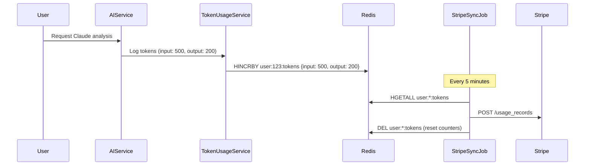
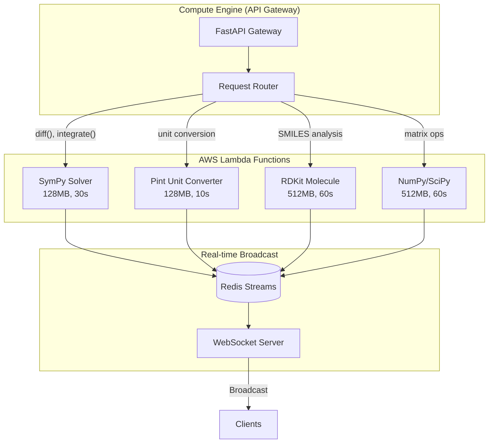

# ILAI.CO.IN — Advanced Infrastructure Refinement

**Version:** 2.0  
**Focus:** Precision Scaling, Financial Protection, Data Integrity  
**Target:** PhD Tier (₹699) & Study War-Rooms

---

## 1. Usage-Based Metering (Stripe Integration)

### 1.1 Architecture Overview



### 1.2 TokenUsageService.java

```java
package com.muse.social.billing;

import org.springframework.data.redis.core.RedisTemplate;
import org.springframework.scheduling.annotation.Scheduled;
import org.springframework.stereotype.Service;
import com.stripe.model.UsageRecord;
import com.stripe.param.UsageRecordCreateOnSubscriptionItemParams;
import lombok.RequiredArgsConstructor;
import lombok.extern.slf4j.Slf4j;

import java.time.Instant;
import java.util.*;

@Service
@RequiredArgsConstructor
@Slf4j
public class TokenUsageService {
    
    private final RedisTemplate<String, Object> redisTemplate;
    private final UserSubscriptionRepository subscriptionRepo;
    
    // Token pricing (per 1K tokens)
    private static final double INPUT_TOKEN_RATE = 0.003;   // $0.003/1K
    private static final double OUTPUT_TOKEN_RATE = 0.015;  // $0.015/1K
    
    // Tier limits (monthly)
    private static final Map<String, Long> TIER_LIMITS = Map.of(
        "general", 50_000L,   // 50K tokens/month included
        "pro", 200_000L,      // 200K tokens/month included
        "phd", 1_000_000L     // 1M tokens/month included, then metered
    );
    
    /**
     * Track token usage for a user. Called after each AI request.
     */
    public void trackUsage(Long userId, int inputTokens, int outputTokens) {
        String key = "usage:tokens:" + userId;
        
        redisTemplate.opsForHash().increment(key, "input", inputTokens);
        redisTemplate.opsForHash().increment(key, "output", outputTokens);
        redisTemplate.opsForHash().increment(key, "requests", 1);
        
        // Set TTL to end of billing period (32 days max)
        redisTemplate.expire(key, java.time.Duration.ofDays(32));
        
        log.debug("Tracked {} input, {} output tokens for user {}", 
                  inputTokens, outputTokens, userId);
    }
    
    /**
     * Check if user has exceeded their tier limit.
     * Returns remaining tokens, or negative if over limit.
     */
    public TokenQuota checkQuota(Long userId) {
        String tier = subscriptionRepo.getTierByUserId(userId);
        long limit = TIER_LIMITS.getOrDefault(tier, 0L);
        
        String key = "usage:tokens:" + userId;
        Long inputUsed = (Long) redisTemplate.opsForHash().get(key, "input");
        Long outputUsed = (Long) redisTemplate.opsForHash().get(key, "output");
        
        long totalUsed = (inputUsed != null ? inputUsed : 0) + 
                         (outputUsed != null ? outputUsed : 0);
        
        return TokenQuota.builder()
            .tier(tier)
            .limit(limit)
            .used(totalUsed)
            .remaining(limit - totalUsed)
            .overageTokens(Math.max(0, totalUsed - limit))
            .build();
    }
    
    /**
     * Sync usage to Stripe every 5 minutes.
     * Only syncs overage for PhD tier (metered billing).
     */
    @Scheduled(fixedRate = 300_000) // 5 minutes
    public void syncUsageToStripe() {
        log.info("Starting Stripe usage sync...");
        
        Set<String> keys = redisTemplate.keys("usage:tokens:*");
        if (keys == null || keys.isEmpty()) return;
        
        for (String key : keys) {
            try {
                Long userId = Long.parseLong(key.split(":")[2]);
                TokenQuota quota = checkQuota(userId);
                
                // Only bill overage for PhD tier
                if (!"phd".equals(quota.getTier()) || quota.getOverageTokens() <= 0) {
                    continue;
                }
                
                // Get Stripe subscription item ID
                String subscriptionItemId = subscriptionRepo
                    .getStripeSubscriptionItemId(userId, "metered_tokens");
                
                if (subscriptionItemId == null) {
                    log.warn("No metered subscription item for user {}", userId);
                    continue;
                }
                
                // Calculate billable units (per 1K tokens)
                long billableUnits = quota.getOverageTokens() / 1000;
                
                if (billableUnits > 0) {
                    // Create usage record in Stripe
                    UsageRecordCreateOnSubscriptionItemParams params = 
                        UsageRecordCreateOnSubscriptionItemParams.builder()
                            .setQuantity(billableUnits)
                            .setTimestamp(Instant.now().getEpochSecond())
                            .setAction(UsageRecordCreateOnSubscriptionItemParams.Action.INCREMENT)
                            .build();
                    
                    UsageRecord.createOnSubscriptionItem(subscriptionItemId, params, null);
                    
                    log.info("Synced {} token units to Stripe for user {}", 
                             billableUnits, userId);
                    
                    // Reset the overage counter (keep base usage for quota display)
                    redisTemplate.opsForHash().put(key, "synced_overage", 
                                                   quota.getOverageTokens());
                }
                
            } catch (Exception e) {
                log.error("Failed to sync usage for key {}: {}", key, e.getMessage());
            }
        }
    }
    
    /**
     * Monthly reset job - runs on 1st of each month.
     */
    @Scheduled(cron = "0 0 0 1 * *")
    public void monthlyReset() {
        Set<String> keys = redisTemplate.keys("usage:tokens:*");
        if (keys != null) {
            redisTemplate.delete(keys);
            log.info("Reset {} user token counters for new billing period", keys.size());
        }
    }
}

@Data
@Builder
class TokenQuota {
    private String tier;
    private long limit;
    private long used;
    private long remaining;
    private long overageTokens;
}
```

### 1.3 Updated StripeWebhookController.java

```java
package com.muse.social.billing;

import com.stripe.model.*;
import com.stripe.net.Webhook;
import org.springframework.web.bind.annotation.*;
import lombok.RequiredArgsConstructor;
import lombok.extern.slf4j.Slf4j;

@RestController
@RequestMapping("/api/webhooks/stripe")
@RequiredArgsConstructor
@Slf4j
public class StripeWebhookController {
    
    private final FeatureFlagService featureFlags;
    private final UserSubscriptionRepository subscriptionRepo;
    private final TokenUsageService tokenUsageService;
    
    @Value("${stripe.webhook.secret}")
    private String webhookSecret;
    
    @PostMapping
    public ResponseEntity<String> handleEvent(
        @RequestBody String payload,
        @RequestHeader("Stripe-Signature") String signature
    ) {
        Event event;
        try {
            event = Webhook.constructEvent(payload, signature, webhookSecret);
        } catch (Exception e) {
            log.error("Webhook signature verification failed: {}", e.getMessage());
            return ResponseEntity.badRequest().body("Invalid signature");
        }
        
        log.info("Received Stripe event: {}", event.getType());
        
        switch (event.getType()) {
            case "checkout.session.completed":
                handleCheckoutComplete(event);
                break;
                
            case "customer.subscription.created":
            case "customer.subscription.updated":
                handleSubscriptionChange(event);
                break;
                
            case "customer.subscription.deleted":
                handleSubscriptionCancelled(event);
                break;
                
            case "invoice.payment_succeeded":
                handlePaymentSuccess(event);
                break;
                
            case "invoice.payment_failed":
                handlePaymentFailed(event);
                break;
                
            // Metered billing events
            case "invoice.upcoming":
                handleUpcomingInvoice(event);
                break;
                
            default:
                log.debug("Unhandled event type: {}", event.getType());
        }
        
        return ResponseEntity.ok("OK");
    }
    
    private void handleCheckoutComplete(Event event) {
        Session session = (Session) event.getDataObjectDeserializer()
            .getObject().orElseThrow();
        
        String userId = session.getClientReferenceId();
        String subscriptionId = session.getSubscription();
        
        // Fetch subscription to get line items
        try {
            Subscription subscription = Subscription.retrieve(subscriptionId);
            
            for (SubscriptionItem item : subscription.getItems().getData()) {
                Price price = item.getPrice();
                String priceId = price.getId();
                String tier = mapPriceToTier(priceId);
                
                // Store subscription item ID for metered billing
                if (price.getRecurring().getUsageType().equals("metered")) {
                    subscriptionRepo.saveMeteredSubscriptionItem(
                        Long.parseLong(userId),
                        item.getId(),
                        "metered_tokens"
                    );
                }
                
                // Update user tier
                subscriptionRepo.updateTier(Long.parseLong(userId), tier);
                featureFlags.enableTierFeatures(userId, tier);
            }
            
            log.info("Checkout complete for user {}, subscription {}", 
                     userId, subscriptionId);
            
        } catch (Exception e) {
            log.error("Failed to process checkout: {}", e.getMessage());
        }
    }
    
    private void handleSubscriptionChange(Event event) {
        Subscription subscription = (Subscription) event.getDataObjectDeserializer()
            .getObject().orElseThrow();
        
        String customerId = subscription.getCustomer();
        Long userId = subscriptionRepo.getUserIdByStripeCustomerId(customerId);
        
        if (userId == null) {
            log.warn("No user found for Stripe customer {}", customerId);
            return;
        }
        
        // Determine tier from subscription items
        String tier = "free";
        for (SubscriptionItem item : subscription.getItems().getData()) {
            String priceId = item.getPrice().getId();
            tier = mapPriceToTier(priceId);
            
            // Track metered items
            if (item.getPrice().getRecurring().getUsageType().equals("metered")) {
                subscriptionRepo.saveMeteredSubscriptionItem(
                    userId, item.getId(), "metered_tokens"
                );
            }
        }
        
        // Update features based on subscription status
        if ("active".equals(subscription.getStatus()) || 
            "trialing".equals(subscription.getStatus())) {
            featureFlags.enableTierFeatures(String.valueOf(userId), tier);
        } else {
            featureFlags.enableTierFeatures(String.valueOf(userId), "free");
        }
        
        log.info("Subscription updated for user {}: tier={}, status={}", 
                 userId, tier, subscription.getStatus());
    }
    
    private void handleUpcomingInvoice(Event event) {
        Invoice invoice = (Invoice) event.getDataObjectDeserializer()
            .getObject().orElseThrow();
        
        String customerId = invoice.getCustomer();
        Long userId = subscriptionRepo.getUserIdByStripeCustomerId(customerId);
        
        if (userId != null) {
            // Force sync any pending usage before invoice finalizes
            tokenUsageService.syncUsageToStripe();
            log.info("Pre-invoice usage sync triggered for user {}", userId);
        }
    }
    
    private String mapPriceToTier(String priceId) {
        return switch (priceId) {
            case "price_general_monthly", "price_general_yearly" -> "general";
            case "price_pro_monthly", "price_pro_yearly" -> "pro";
            case "price_phd_monthly", "price_phd_yearly" -> "phd";
            default -> "free";
        };
    }
}
```

---

## 2. Lambda-based Scientific Solving

### 2.1 Architecture Overview



### 2.2 Lambda Wrapper (sympy_solver_lambda.py)

```python
# sympy_solver_lambda.py
# Deploy as AWS Lambda with sympy layer

import json
import boto3
import sympy as sp
from sympy.parsing.sympy_parser import (
    parse_expr, 
    standard_transformations, 
    implicit_multiplication_application
)

# Redis connection via Lambda layer or VPC
redis_client = None  # Initialized in handler

def lambda_handler(event, context):
    """
    AWS Lambda handler for SymPy symbolic mathematics.
    
    Input event:
    {
        "expression": "diff(x^2 + 3*x, x)",
        "operation": "solve" | "diff" | "integrate" | "limit" | "simplify",
        "variables": {"x": 5},
        "user_id": "123",
        "room_id": "war-room-456",  # Optional, for real-time broadcast
        "request_id": "uuid"
    }
    """
    try:
        expr_str = event.get('expression', '')
        operation = event.get('operation', 'solve')
        variables = event.get('variables', {})
        user_id = event.get('user_id')
        room_id = event.get('room_id')
        request_id = event.get('request_id')
        
        # Parse expression
        transformations = standard_transformations + (implicit_multiplication_application,)
        expr = parse_expr(expr_str, transformations=transformations)
        
        # Apply variable substitutions
        for var, val in variables.items():
            expr = expr.subs(sp.Symbol(var), val)
        
        # Perform operation
        result = perform_operation(expr, operation, expr_str)
        
        response = {
            'success': True,
            'request_id': request_id,
            'result': str(result['value']),
            'result_latex': sp.latex(result['value']),
            'steps': result.get('steps', []),
            'derivation_latex': result.get('derivation', ''),
            'operation': operation,
            'execution_time_ms': context.get_remaining_time_in_millis() 
        }
        
        # Broadcast to Redis Stream if in a War Room
        if room_id:
            broadcast_to_room(room_id, user_id, response)
        
        return {
            'statusCode': 200,
            'body': json.dumps(response)
        }
        
    except Exception as e:
        error_response = {
            'success': False,
            'error': str(e),
            'error_type': type(e).__name__,
            'request_id': event.get('request_id')
        }
        
        return {
            'statusCode': 400,
            'body': json.dumps(error_response)
        }


def perform_operation(expr, operation: str, original: str) -> dict:
    """Execute the requested mathematical operation."""
    
    x = sp.Symbol('x')
    steps = [f"Input: {original}"]
    
    if operation == 'diff' or 'diff(' in original.lower():
        # Differentiation
        result = sp.diff(expr, x)
        steps.append(f"Differentiate with respect to x")
        steps.append(f"Result: {result}")
        derivation = f"\\frac{{d}}{{dx}}({sp.latex(expr)}) = {sp.latex(result)}"
        
    elif operation == 'integrate' or 'integrate(' in original.lower():
        # Integration
        result = sp.integrate(expr, x)
        steps.append(f"Integrate with respect to x")
        steps.append(f"Result: {result} + C")
        derivation = f"\\int ({sp.latex(expr)}) dx = {sp.latex(result)} + C"
        
    elif operation == 'limit':
        # Limit (default to x -> 0)
        result = sp.limit(expr, x, 0)
        steps.append(f"Take limit as x → 0")
        steps.append(f"Result: {result}")
        derivation = f"\\lim_{{x \\to 0}} ({sp.latex(expr)}) = {sp.latex(result)}"
        
    elif operation == 'simplify':
        result = sp.simplify(expr)
        steps.append(f"Simplify expression")
        steps.append(f"Result: {result}")
        derivation = f"{sp.latex(expr)} = {sp.latex(result)}"
        
    elif operation == 'solve':
        # Solve equation (assume = 0)
        solutions = sp.solve(expr, x)
        result = solutions if solutions else expr
        steps.append(f"Solve for x")
        if solutions:
            steps.append(f"Solutions: {solutions}")
            derivation = f"{sp.latex(expr)} = 0 \\Rightarrow x = {sp.latex(solutions)}"
        else:
            derivation = f"Evaluate: {sp.latex(expr)}"
            
    else:
        # Default: evaluate
        result = expr.evalf() if hasattr(expr, 'evalf') else expr
        steps.append(f"Evaluate: {result}")
        derivation = f"{sp.latex(expr)}"
    
    return {
        'value': result,
        'steps': steps,
        'derivation': derivation
    }


def broadcast_to_room(room_id: str, user_id: str, result: dict):
    """Send result to Redis Stream for War Room broadcast."""
    import redis
    
    # Connect to ElastiCache (configure via environment)
    r = redis.Redis(
        host=os.environ.get('REDIS_HOST', 'localhost'),
        port=6379,
        decode_responses=True
    )
    
    stream_key = f"room:{room_id}:results"
    
    r.xadd(stream_key, {
        'user_id': user_id,
        'request_id': result['request_id'],
        'result': result['result'],
        'result_latex': result['result_latex'],
        'timestamp': str(time.time())
    }, maxlen=1000)
    
    # Also publish for immediate WebSocket push
    r.publish(f"room:{room_id}:updates", json.dumps({
        'type': 'solve_result',
        'data': result
    }))
```

### 2.3 Compute Engine Gateway (main.py update)

```python
# Add to muse-compute-engine/main.py

import boto3
import json
from fastapi import BackgroundTasks

# Lambda client
lambda_client = boto3.client('lambda', region_name='ap-south-1')

# Lambda function ARNs
LAMBDA_FUNCTIONS = {
    'sympy': os.getenv('LAMBDA_SYMPY_ARN'),
    'pint': os.getenv('LAMBDA_PINT_ARN'),
    'rdkit': os.getenv('LAMBDA_RDKIT_ARN'),
    'scipy': os.getenv('LAMBDA_SCIPY_ARN'),
}

# Threshold for Lambda offload (high concurrency or complex operations)
LAMBDA_THRESHOLD_CONCURRENT = 10  # Offload when >10 concurrent requests
COMPLEX_OPERATIONS = ['diff', 'integrate', 'limit', 'matrix', 'eigenvalue']


class SolverRequest(BaseModel):
    expression: str
    variables: Optional[Dict[str, Any]] = None
    user_id: Optional[str] = None
    room_id: Optional[str] = None  # For War Room broadcast
    subject: Optional[str] = None
    use_lambda: Optional[bool] = None  # Force Lambda execution


@app.post("/api/solver/solve")
async def solve_expression(request: SolverRequest, background_tasks: BackgroundTasks):
    """
    Unified solver with automatic Lambda offloading.
    """
    expr_str = request.expression.strip()
    
    # Determine if we should use Lambda
    should_use_lambda = (
        request.use_lambda or 
        is_complex_operation(expr_str) or
        get_concurrent_requests() > LAMBDA_THRESHOLD_CONCURRENT
    )
    
    if should_use_lambda and LAMBDA_FUNCTIONS.get('sympy'):
        return await invoke_lambda_solver(request)
    else:
        return await solve_locally(request)


async def invoke_lambda_solver(request: SolverRequest):
    """Invoke AWS Lambda for heavy computation."""
    
    # Determine which Lambda to use
    operation = detect_operation(request.expression)
    lambda_arn = LAMBDA_FUNCTIONS.get('sympy')  # Default to SymPy
    
    if 'mol' in request.expression.lower() or is_smiles(request.expression):
        lambda_arn = LAMBDA_FUNCTIONS.get('rdkit')
    elif has_units(request.expression):
        lambda_arn = LAMBDA_FUNCTIONS.get('pint')
    
    request_id = str(uuid.uuid4())
    
    payload = {
        'expression': request.expression,
        'operation': operation,
        'variables': request.variables or {},
        'user_id': request.user_id,
        'room_id': request.room_id,
        'request_id': request_id
    }
    
    try:
        # Async Lambda invocation
        response = lambda_client.invoke(
            FunctionName=lambda_arn,
            InvocationType='RequestResponse',  # Sync for immediate result
            Payload=json.dumps(payload)
        )
        
        result = json.loads(response['Payload'].read())
        
        if response['StatusCode'] == 200:
            body = json.loads(result.get('body', '{}'))
            return body
        else:
            return {'success': False, 'error': 'Lambda execution failed'}
            
    except Exception as e:
        # Fallback to local execution
        logging.warning(f"Lambda failed, falling back to local: {e}")
        return await solve_locally(request)


def is_complex_operation(expr: str) -> bool:
    """Check if expression requires heavy computation."""
    expr_lower = expr.lower()
    return any(op in expr_lower for op in COMPLEX_OPERATIONS)


def detect_operation(expr: str) -> str:
    """Detect the primary operation from expression."""
    expr_lower = expr.lower()
    if 'diff(' in expr_lower or 'derivative' in expr_lower:
        return 'diff'
    elif 'integrate(' in expr_lower or '∫' in expr:
        return 'integrate'
    elif 'limit(' in expr_lower:
        return 'limit'
    elif 'simplify(' in expr_lower:
        return 'simplify'
    else:
        return 'solve'
```

---

## 3. CRDT Variable Conflict Resolution

### 3.1 Vector Clock Implementation

```java
package com.muse.labs.sync;

import lombok.Data;
import lombok.Builder;
import java.util.*;
import java.math.BigDecimal;
import java.math.MathContext;

/**
 * Vector Clock for distributed variable synchronization.
 * Ensures causal ordering and conflict detection in War Rooms.
 */
@Data
@Builder
public class VectorClock {
    
    private Map<String, Long> clock;  // nodeId -> logical timestamp
    
    public VectorClock() {
        this.clock = new ConcurrentHashMap<>();
    }
    
    public VectorClock(Map<String, Long> clock) {
        this.clock = new ConcurrentHashMap<>(clock);
    }
    
    /**
     * Increment clock for a node (on local update).
     */
    public void increment(String nodeId) {
        clock.merge(nodeId, 1L, Long::sum);
    }
    
    /**
     * Merge with another clock (on receive).
     */
    public void merge(VectorClock other) {
        for (Map.Entry<String, Long> entry : other.clock.entrySet()) {
            clock.merge(entry.getKey(), entry.getValue(), Math::max);
        }
    }
    
    /**
     * Compare two clocks.
     * Returns:
     *   -1 : this HAPPENED_BEFORE other
     *    0 : CONCURRENT (conflict!)
     *    1 : other HAPPENED_BEFORE this
     */
    public int compareTo(VectorClock other) {
        boolean thisGreater = false;
        boolean otherGreater = false;
        
        Set<String> allNodes = new HashSet<>();
        allNodes.addAll(this.clock.keySet());
        allNodes.addAll(other.clock.keySet());
        
        for (String node : allNodes) {
            long thisVal = this.clock.getOrDefault(node, 0L);
            long otherVal = other.clock.getOrDefault(node, 0L);
            
            if (thisVal > otherVal) thisGreater = true;
            if (otherVal > thisVal) otherGreater = true;
        }
        
        if (thisGreater && !otherGreater) return 1;   // this is newer
        if (otherGreater && !thisGreater) return -1;  // other is newer
        return 0;  // Concurrent - CONFLICT
    }
    
    public boolean isConcurrentWith(VectorClock other) {
        return compareTo(other) == 0 && !this.equals(other);
    }
}


/**
 * Scientific Variable with CRDT support.
 */
@Data
@Builder
public class ScientificVariable {
    
    private String symbol;
    private String value;
    private String unit;
    private int precision;  // Decimal precision
    private VectorClock vectorClock;
    private String lastUpdatedBy;
    private long timestamp;
    private String source;  // "user" | "solver" | "research"
    private boolean verified;  // Verified by solver or authority
}


/**
 * CRDT-based Variable Conflict Resolver.
 * Preserves mathematical precision and causal ordering.
 */
@Service
@Slf4j
public class VariableConflictResolver {
    
    private static final MathContext PRECISION = MathContext.DECIMAL128;
    
    /**
     * Resolve conflict between two variable versions.
     * 
     * Priority order:
     * 1. Causally ordered (via vector clock)
     * 2. Verified values > unverified
     * 3. Higher precision wins
     * 4. Solver-generated > user-input
     * 5. Last-writer-wins (fallback)
     */
    public ScientificVariable resolve(
            ScientificVariable incoming, 
            ScientificVariable existing) {
        
        // Case 1: Vector clock determines order
        int clockComparison = incoming.getVectorClock()
                                      .compareTo(existing.getVectorClock());
        
        if (clockComparison > 0) {
            log.debug("Incoming is causally newer: {}", incoming.getSymbol());
            return incoming;
        }
        
        if (clockComparison < 0) {
            log.debug("Existing is causally newer: {}", existing.getSymbol());
            return existing;
        }
        
        // Case 2: Concurrent updates - apply scientific resolution
        log.info("Concurrent conflict detected for variable: {}", 
                 incoming.getSymbol());
        
        return resolveConflict(incoming, existing);
    }
    
    private ScientificVariable resolveConflict(
            ScientificVariable a, 
            ScientificVariable b) {
        
        int score_a = 0;
        int score_b = 0;
        
        // Rule 1: Verified values are preferred
        if (a.isVerified() && !b.isVerified()) return a;
        if (b.isVerified() && !a.isVerified()) return b;
        
        // Rule 2: Higher precision wins
        int precisionDiff = a.getPrecision() - b.getPrecision();
        if (precisionDiff > 2) return a;  // Significantly more precise
        if (precisionDiff < -2) return b;
        
        // Rule 3: Solver-generated > user input
        if ("solver".equals(a.getSource()) && !"solver".equals(b.getSource())) {
            score_a += 2;
        }
        if ("solver".equals(b.getSource()) && !"solver".equals(a.getSource())) {
            score_b += 2;
        }
        
        // Rule 4: Research-sourced values are authoritative
        if ("research".equals(a.getSource())) score_a += 3;
        if ("research".equals(b.getSource())) score_b += 3;
        
        // Rule 5: More recent timestamp as tiebreaker
        if (score_a == score_b) {
            return a.getTimestamp() > b.getTimestamp() ? a : b;
        }
        
        ScientificVariable winner = score_a > score_b ? a : b;
        
        log.info("Conflict resolved for {}: winner={} (score: a={}, b={})",
                 a.getSymbol(), winner.getLastUpdatedBy(), score_a, score_b);
        
        // Merge vector clocks
        winner.getVectorClock().merge(
            score_a > score_b ? b.getVectorClock() : a.getVectorClock()
        );
        
        return winner;
    }
    
    /**
     * Calculate precision of a numeric value.
     */
    public int calculatePrecision(String value) {
        try {
            BigDecimal bd = new BigDecimal(value, PRECISION);
            return bd.precision();
        } catch (NumberFormatException e) {
            return 0;  // Non-numeric
        }
    }
    
    /**
     * Validate that two values are mathematically equivalent
     * within acceptable tolerance.
     */
    public boolean isEquivalent(String val1, String val2, int toleranceDigits) {
        try {
            BigDecimal bd1 = new BigDecimal(val1, PRECISION);
            BigDecimal bd2 = new BigDecimal(val2, PRECISION);
            
            BigDecimal diff = bd1.subtract(bd2).abs();
            BigDecimal tolerance = BigDecimal.ONE.scaleByPowerOfTen(-toleranceDigits);
            
            return diff.compareTo(tolerance) < 0;
        } catch (NumberFormatException e) {
            return val1.equals(val2);  // String comparison for non-numeric
        }
    }
}
```

### 3.2 War Room Variable Sync (Updated)

```java
// WarRoomVariableHandler.java

@Component
@RequiredArgsConstructor
@Slf4j
public class WarRoomVariableHandler implements WebSocketHandler {
    
    private final VariableConflictResolver conflictResolver;
    private final RedisTemplate<String, Object> redisTemplate;
    
    // In-memory state per room (also persisted to Redis)
    private final ConcurrentMap<String, Map<String, ScientificVariable>> roomVariables 
        = new ConcurrentHashMap<>();
    
    @Override
    public void handleMessage(WebSocketSession session, WebSocketMessage<?> message) {
        try {
            VariableUpdate update = objectMapper.readValue(
                message.getPayload().toString(), 
                VariableUpdate.class
            );
            
            String roomId = getRoomId(session);
            String nodeId = getNodeId(session);  // User's unique session ID
            
            Map<String, ScientificVariable> roomState = 
                roomVariables.computeIfAbsent(roomId, k -> new ConcurrentHashMap<>());
            
            ScientificVariable incoming = ScientificVariable.builder()
                .symbol(update.getSymbol())
                .value(update.getValue())
                .unit(update.getUnit())
                .precision(conflictResolver.calculatePrecision(update.getValue()))
                .vectorClock(update.getVectorClock())
                .lastUpdatedBy(nodeId)
                .timestamp(System.currentTimeMillis())
                .source(update.getSource())
                .verified(update.isVerified())
                .build();
            
            // Increment vector clock for this node
            incoming.getVectorClock().increment(nodeId);
            
            // Check for existing variable
            ScientificVariable existing = roomState.get(update.getSymbol());
            
            ScientificVariable resolved;
            if (existing == null) {
                resolved = incoming;
            } else {
                resolved = conflictResolver.resolve(incoming, existing);
            }
            
            // Update room state
            roomState.put(update.getSymbol(), resolved);
            
            // Persist to Redis
            persistToRedis(roomId, resolved);
            
            // Broadcast to all participants
            broadcastUpdate(roomId, resolved, session);
            
        } catch (Exception e) {
            log.error("Failed to handle variable update: {}", e.getMessage());
            sendError(session, e.getMessage());
        }
    }
    
    private void broadcastUpdate(String roomId, ScientificVariable variable, 
                                  WebSocketSession excludeSession) {
        
        VariableBroadcast broadcast = VariableBroadcast.builder()
            .type("variable_update")
            .symbol(variable.getSymbol())
            .value(variable.getValue())
            .unit(variable.getUnit())
            .precision(variable.getPrecision())
            .vectorClock(variable.getVectorClock())
            .updatedBy(variable.getLastUpdatedBy())
            .timestamp(variable.getTimestamp())
            .source(variable.getSource())
            .verified(variable.isVerified())
            .build();
        
        // Get all sessions in room
        Set<WebSocketSession> roomSessions = getRoomSessions(roomId);
        
        String json = objectMapper.writeValueAsString(broadcast);
        
        for (WebSocketSession session : roomSessions) {
            if (!session.equals(excludeSession) && session.isOpen()) {
                try {
                    session.sendMessage(new TextMessage(json));
                } catch (IOException e) {
                    log.warn("Failed to broadcast to session: {}", e.getMessage());
                }
            }
        }
    }
}
```

---

## 4. pgvector HNSW Optimization

### 4.1 Aurora Serverless v2 Setup

```sql
-- ============================================================
-- ILAI Paper-Graph: pgvector Optimization for 100K+ Papers
-- ============================================================

-- 1. Enable pgvector extension
CREATE EXTENSION IF NOT EXISTS vector;

-- 2. Create research_papers table with embedding
CREATE TABLE IF NOT EXISTS research_papers (
    id BIGSERIAL PRIMARY KEY,
    arxiv_id VARCHAR(50) UNIQUE,
    doi VARCHAR(100),
    title TEXT NOT NULL,
    abstract TEXT,
    authors TEXT[],
    categories TEXT[],
    published_date DATE,
    pdf_url TEXT,
    
    -- Vector embedding (OpenAI ada-002 = 1536 dims, Titan = 1024)
    embedding vector(1536),
    
    -- Metadata
    cited_by_count INT DEFAULT 0,
    reference_count INT DEFAULT 0,
    created_at TIMESTAMP DEFAULT NOW(),
    updated_at TIMESTAMP DEFAULT NOW()
);

-- 3. Create HNSW index for fast similarity search
-- HNSW parameters:
--   m: max connections per layer (higher = more accurate, slower build)
--   ef_construction: search width during index build
CREATE INDEX IF NOT EXISTS idx_papers_embedding_hnsw 
ON research_papers 
USING hnsw (embedding vector_cosine_ops)
WITH (
    m = 16,              -- Good balance for 100K vectors
    ef_construction = 64 -- Higher for better recall
);

-- 4. Create additional indexes for filtering
CREATE INDEX idx_papers_categories ON research_papers USING gin(categories);
CREATE INDEX idx_papers_published ON research_papers (published_date DESC);
CREATE INDEX idx_papers_cited ON research_papers (cited_by_count DESC);

-- 5. User-paper relationship table
CREATE TABLE IF NOT EXISTS user_paper_links (
    id BIGSERIAL PRIMARY KEY,
    user_id BIGINT NOT NULL,
    paper_id BIGINT REFERENCES research_papers(id) ON DELETE CASCADE,
    note_id BIGINT,  -- Link to user's research note
    
    -- Relevance metrics
    relevance_score FLOAT DEFAULT 0,
    interaction_count INT DEFAULT 1,
    
    -- Link type
    link_type VARCHAR(20) DEFAULT 'viewed',  -- viewed | cited | saved | annotated
    
    created_at TIMESTAMP DEFAULT NOW(),
    updated_at TIMESTAMP DEFAULT NOW(),
    
    UNIQUE(user_id, paper_id)
);

CREATE INDEX idx_user_papers_user ON user_paper_links(user_id);
CREATE INDEX idx_user_papers_relevance ON user_paper_links(relevance_score DESC);

-- 6. Optimized similarity search function
CREATE OR REPLACE FUNCTION find_similar_papers(
    query_embedding vector(1536),
    limit_count INT DEFAULT 10,
    category_filter TEXT[] DEFAULT NULL,
    min_citations INT DEFAULT 0
)
RETURNS TABLE (
    paper_id BIGINT,
    arxiv_id VARCHAR(50),
    title TEXT,
    abstract TEXT,
    similarity FLOAT,
    cited_by_count INT
) 
LANGUAGE plpgsql
AS $$
BEGIN
    -- Set HNSW search parameter for query
    -- Higher ef = more accurate but slower
    SET LOCAL hnsw.ef_search = 100;
    
    RETURN QUERY
    SELECT 
        rp.id,
        rp.arxiv_id,
        rp.title,
        LEFT(rp.abstract, 500) as abstract,
        1 - (rp.embedding <=> query_embedding) as similarity,
        rp.cited_by_count
    FROM research_papers rp
    WHERE 
        (category_filter IS NULL OR rp.categories && category_filter)
        AND rp.cited_by_count >= min_citations
        AND rp.embedding IS NOT NULL
    ORDER BY rp.embedding <=> query_embedding
    LIMIT limit_count;
END;
$$;

-- 7. Find papers related to user's research notes
CREATE OR REPLACE FUNCTION get_personalized_recommendations(
    p_user_id BIGINT,
    limit_count INT DEFAULT 10
)
RETURNS TABLE (
    paper_id BIGINT,
    title TEXT,
    relevance_score FLOAT,
    reason TEXT
)
LANGUAGE plpgsql
AS $$
DECLARE
    user_interest_vector vector(1536);
BEGIN
    -- Compute average embedding of user's interacted papers
    SELECT AVG(rp.embedding) INTO user_interest_vector
    FROM user_paper_links upl
    JOIN research_papers rp ON rp.id = upl.paper_id
    WHERE upl.user_id = p_user_id
    AND upl.link_type IN ('saved', 'cited', 'annotated');
    
    IF user_interest_vector IS NULL THEN
        -- No interaction history, return trending papers
        RETURN QUERY
        SELECT 
            rp.id,
            rp.title,
            rp.cited_by_count::FLOAT / 1000 as relevance_score,
            'Trending in your field' as reason
        FROM research_papers rp
        ORDER BY rp.cited_by_count DESC
        LIMIT limit_count;
    ELSE
        -- Return similar papers not yet seen
        RETURN QUERY
        SELECT 
            rp.id,
            rp.title,
            1 - (rp.embedding <=> user_interest_vector) as relevance_score,
            'Based on your research interests' as reason
        FROM research_papers rp
        WHERE rp.id NOT IN (
            SELECT paper_id FROM user_paper_links WHERE user_id = p_user_id
        )
        AND rp.embedding IS NOT NULL
        ORDER BY rp.embedding <=> user_interest_vector
        LIMIT limit_count;
    END IF;
END;
$$;

-- 8. Performance monitoring view
CREATE OR REPLACE VIEW v_pgvector_stats AS
SELECT 
    relname as index_name,
    pg_size_pretty(pg_relation_size(indexrelid)) as index_size,
    idx_scan as index_scans,
    idx_tup_read as tuples_read,
    idx_tup_fetch as tuples_fetched
FROM pg_stat_user_indexes
WHERE indexrelname LIKE '%embedding%';

-- 9. Maintenance: Analyze for query planner
ANALYZE research_papers;

-- 10. Optional: Partial index for high-quality papers only
CREATE INDEX idx_papers_embedding_quality_hnsw
ON research_papers 
USING hnsw (embedding vector_cosine_ops)
WITH (m = 24, ef_construction = 100)
WHERE cited_by_count >= 10;
```

### 4.2 Query Performance Benchmarks

```sql
-- Test query performance (run with EXPLAIN ANALYZE)

-- Benchmark 1: Pure similarity search
EXPLAIN ANALYZE
SELECT * FROM find_similar_papers(
    (SELECT embedding FROM research_papers WHERE arxiv_id = '2301.00001'),
    10,
    ARRAY['cs.AI', 'cs.LG'],
    5
);
-- Expected: < 50ms for 100K papers with HNSW

-- Benchmark 2: Personalized recommendations
EXPLAIN ANALYZE
SELECT * FROM get_personalized_recommendations(123, 10);
-- Expected: < 100ms

-- Monitor index usage
SELECT * FROM v_pgvector_stats;
```

---

## Summary: Critical Path Deliverables

| Priority | Component | File | Sprint |
|----------|-----------|------|--------|
| **P0** | Token Usage Service | `TokenUsageService.java` | Sprint 4 |
| **P0** | Stripe Webhook Handler | `StripeWebhookController.java` | Sprint 4 |
| **P1** | Lambda Solver Wrapper | `sympy_solver_lambda.py` | Sprint 7 |
| **P1** | Compute Engine Gateway | `main.py` (update) | Sprint 7 |
| **P1** | Vector Clock CRDT | `VectorClock.java` | Sprint 6 |
| **P1** | Conflict Resolver | `VariableConflictResolver.java` | Sprint 6 |
| **P2** | HNSW Index Migration | `V5__pgvector_hnsw.sql` | Sprint 11 |
| **P2** | Similarity Functions | `V6__paper_search.sql` | Sprint 11 |
