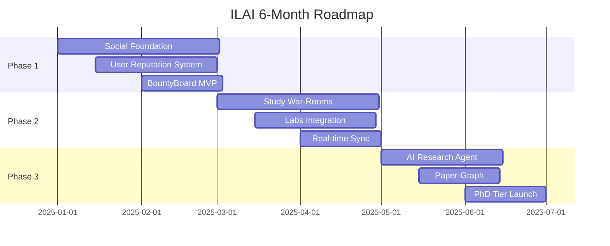
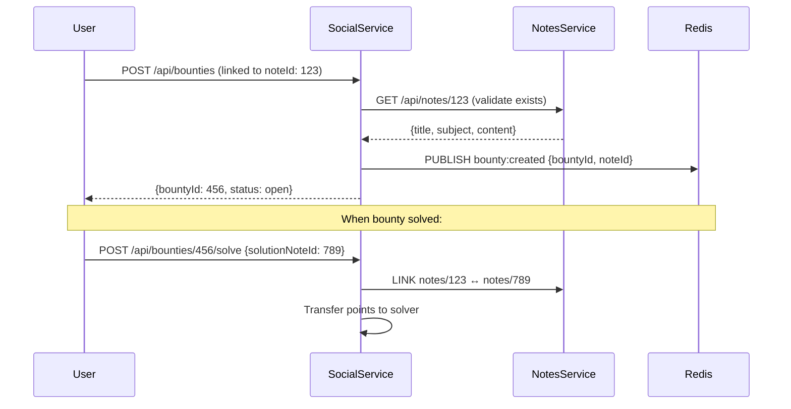
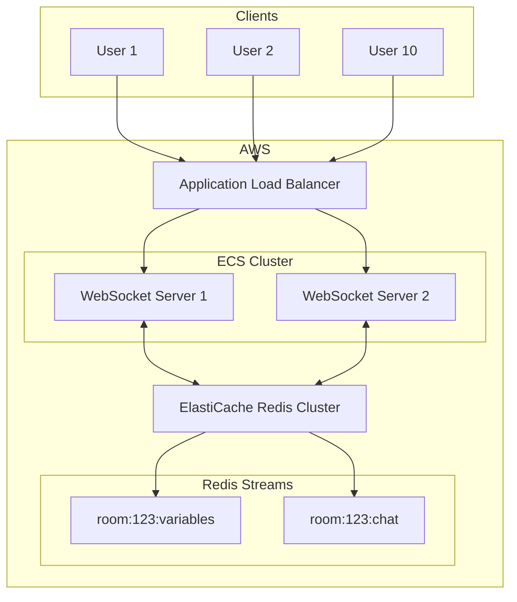

# ILAI.CO.IN — 6-Month Implementation Roadmap

**Version:** 1.0  
**Timeline:** January 2025 - June 2025  
**Pricing Tiers:** Free | General (₹199) | Pro (₹399) | PhD (₹699)

---

## Executive Summary



---

## 1. Infrastructure Sequencing

### 1.1 AWS Aurora Serverless v2 Schema Strategy

| Phase | Database | Tables | Vector Support |
|-------|----------|--------|----------------|
| **Phase 1** | `ilai_core` | users, posts, notes, conversations | None |
| **Phase 2** | `ilai_labs` | variables, expressions, workspaces | None |
| **Phase 3** | `ilai_research` | papers, embeddings, citations | pgvector |

#### Migration Sequence

```sql
-- Phase 1: Core Tables (Month 1)
CREATE DATABASE ilai_core;

-- Schema: Social
CREATE TABLE user_profiles (
    id BIGSERIAL PRIMARY KEY,
    user_id BIGINT UNIQUE NOT NULL,
    reputation_score INT DEFAULT 0,
    tier VARCHAR(20) DEFAULT 'free',  -- free | general | pro | phd
    streak_days INT DEFAULT 0,
    created_at TIMESTAMP DEFAULT NOW()
);

CREATE TABLE bounties (
    id BIGSERIAL PRIMARY KEY,
    creator_id BIGINT REFERENCES user_profiles(id),
    linked_note_id BIGINT,  -- FK to notes service
    title VARCHAR(200),
    reward_points INT,
    status VARCHAR(20) DEFAULT 'open',
    deadline TIMESTAMP
);

-- Phase 2: Labs Tables (Month 3)
CREATE TABLE study_rooms (
    id BIGSERIAL PRIMARY KEY,
    name VARCHAR(100),
    subject VARCHAR(50),
    max_participants INT DEFAULT 10,
    is_active BOOLEAN DEFAULT TRUE,
    created_by BIGINT
);

CREATE TABLE room_variables (
    id BIGSERIAL PRIMARY KEY,
    room_id BIGINT REFERENCES study_rooms(id),
    symbol VARCHAR(50),
    value TEXT,
    updated_by BIGINT,
    version INT DEFAULT 1
);

-- Phase 3: Research Tables (Month 5)
CREATE EXTENSION IF NOT EXISTS vector;

CREATE TABLE research_papers (
    id BIGSERIAL PRIMARY KEY,
    arxiv_id VARCHAR(50),
    title TEXT,
    abstract TEXT,
    embedding vector(1536),  -- OpenAI ada-002 / Bedrock Titan
    cited_by_count INT DEFAULT 0
);

CREATE TABLE user_paper_links (
    user_id BIGINT,
    paper_id BIGINT REFERENCES research_papers(id),
    note_id BIGINT,  -- User's research note
    relevance_score FLOAT,
    PRIMARY KEY (user_id, paper_id)
);
```

### 1.2 ECS Task Definitions

#### Phase 1 Configuration (Social/General)

```yaml
# ecs-task-phase1.yaml
family: ilai-core-services
networkMode: awsvpc
requiresCompatibilities: [FARGATE]
cpu: 1024      # 1 vCPU
memory: 2048   # 2 GB

containerDefinitions:
  - name: auth-service
    image: ghcr.io/prasanth-alaparthi/ilai-auth:latest
    cpu: 256, memory: 512
    portMappings: [{containerPort: 8081}]
    
  - name: notes-service
    image: ghcr.io/prasanth-alaparthi/ilai-notes:latest
    cpu: 256, memory: 512
    portMappings: [{containerPort: 8082}]
    
  - name: social-service
    image: ghcr.io/prasanth-alaparthi/ilai-social:latest
    cpu: 256, memory: 512
    portMappings: [{containerPort: 8083}]
    
  - name: frontend
    image: ghcr.io/prasanth-alaparthi/ilai-frontend:latest
    cpu: 256, memory: 512
    portMappings: [{containerPort: 80}]
```

#### Phase 2 Scaling (Engineering Labs)

```yaml
# ecs-task-phase2.yaml (adds compute-intensive services)
# Total: 4 vCPU, 8 GB RAM

containerDefinitions:
  # ... Phase 1 containers ...
  
  - name: compute-engine
    image: ghcr.io/prasanth-alaparthi/ilai-labs:latest
    cpu: 1024     # 1 vCPU for SymPy/NumPy
    memory: 2048  # 2 GB for scientific compute
    portMappings: [{containerPort: 8000}]
    environment:
      - REDIS_URL=redis://elasticache:6379
      
  - name: agentic-rag
    image: ghcr.io/prasanth-alaparthi/ilai-rag:latest
    cpu: 512
    memory: 1024
    portMappings: [{containerPort: 8001}]
```

---

## 2. Feature Dependency Mapping

### 2.1 Phase 1: Reputation & Bounty System (Month 1-2)

#### BountyBoard ↔ Notes Integration



#### Java Controllers (Sprint 1-4)

```java
// BountyController.java
@RestController
@RequestMapping("/api/bounties")
public class BountyController {
    
    @PostMapping
    public BountyResponse create(@RequestBody CreateBountyRequest req) {
        // 1. Validate user has enough points (tier-based)
        // 2. Link to Note via REST call
        // 3. Publish to Redis for real-time updates
    }
    
    @PostMapping("/{id}/solve")
    public SolutionResponse solve(@PathVariable Long id, 
                                   @RequestBody SolveBountyRequest req) {
        // 1. Validate solution note exists
        // 2. Award points to solver
        // 3. Update reputation scores
    }
}
```

#### Reputation Scoring

| Action | Points | Tier Required |
|--------|--------|---------------|
| Create post | +5 | Free |
| Solve bounty | +50 | Free |
| Create bounty | -20 | General |
| Receive upvote | +2 | Free |
| Daily streak | +10 | Free |

---

### 2.2 Phase 2: Study War-Rooms (Month 3-5)

#### WebSocket Architecture for 10+ Users



#### Redis Variable Sync Strategy

```python
# war_room_sync.py
import redis.asyncio as redis
import json

class WarRoomSync:
    """
    Handles real-time variable sync for 10+ concurrent users.
    Uses Redis Streams for ordered event processing.
    """
    
    SYNC_BATCH_SIZE = 50  # Batch updates to reduce network calls
    DEBOUNCE_MS = 100     # Debounce rapid keystrokes
    
    async def broadcast_variable(self, room_id: str, variable: dict):
        """
        Optimistic locking with version numbers to prevent conflicts.
        """
        stream_key = f"room:{room_id}:variables"
        
        # Add to Redis Stream with auto-generated ID
        await self.redis.xadd(stream_key, {
            'symbol': variable['symbol'],
            'value': variable['value'],
            'version': variable['version'],
            'updated_by': variable['user_id'],
            'timestamp': time.time()
        }, maxlen=1000)  # Keep last 1000 updates
        
        # Publish to connected WebSockets
        await self.redis.publish(
            f"room:{room_id}:updates",
            json.dumps(variable)
        )
    
    async def sync_to_client(self, room_id: str, last_id: str = '0'):
        """
        Client reconnection: fetch missed updates from stream.
        """
        stream_key = f"room:{room_id}:variables"
        
        # Read all events after client's last known ID
        events = await self.redis.xread(
            {stream_key: last_id},
            count=100
        )
        return events
```

#### Conflict Resolution

```java
// VariableConflictResolver.java
public class VariableConflictResolver {
    
    /**
     * LWW (Last-Writer-Wins) with vector clock fallback.
     * For scientific calculations, we preserve precision.
     */
    public Variable resolve(Variable incoming, Variable existing) {
        // 1. If same version, compare timestamps
        if (incoming.getVersion() == existing.getVersion()) {
            return incoming.getTimestamp() > existing.getTimestamp() 
                ? incoming : existing;
        }
        
        // 2. Higher version always wins
        return incoming.getVersion() > existing.getVersion() 
            ? incoming : existing;
    }
}
```

---

### 2.3 Phase 3: AI Research Integration (Month 6)

#### Paper-Graph with pgvector

```sql
-- Create similarity search function
CREATE FUNCTION find_related_papers(
    user_embedding vector(1536),
    limit_count INT DEFAULT 10
) RETURNS TABLE (
    paper_id BIGINT,
    title TEXT,
    similarity FLOAT
) AS $$
BEGIN
    RETURN QUERY
    SELECT 
        rp.id,
        rp.title,
        1 - (rp.embedding <=> user_embedding) as similarity
    FROM research_papers rp
    ORDER BY rp.embedding <=> user_embedding
    LIMIT limit_count;
END;
$$ LANGUAGE plpgsql;
```

#### Amazon Bedrock Integration

```python
# research_agent.py
import boto3
from anthropic import AnthropicBedrock

class ResearchAgent:
    """
    PhD-tier AI research assistant using Claude 3.5 Sonnet.
    """
    
    def __init__(self):
        self.bedrock = AnthropicBedrock(
            aws_region="ap-south-1"
        )
        self.exa_client = Exa(api_key=os.getenv("EXA_API_KEY"))
    
    async def analyze_paper(self, paper_url: str, user_notes: list):
        """
        Cross-reference paper with user's research notes.
        """
        # 1. Fetch paper content via Exa
        paper_content = await self.exa_client.get_contents(
            [paper_url],
            text={"max_characters": 50000}
        )
        
        # 2. Embed paper for vector search
        embedding = await self.get_embedding(paper_content.text)
        
        # 3. Find related user notes via pgvector
        related_notes = await self.db.execute(
            "SELECT * FROM user_paper_links WHERE ..."
        )
        
        # 4. Generate analysis with Claude
        response = self.bedrock.messages.create(
            model="anthropic.claude-3-5-sonnet-20241022-v2:0",
            messages=[{
                "role": "user",
                "content": f"""
                Analyze this research paper in context of the user's notes:
                
                Paper: {paper_content.text[:10000]}
                
                User Notes: {related_notes}
                
                Provide:
                1. Key insights relevant to user's research
                2. Potential citations to add
                3. Gaps in understanding
                """
            }]
        )
        
        return response.content
```

---

## 3. Financial Guardrails

### 3.1 Cost-Per-Feature Matrix

| Feature | AWS Service | Cost/1K Users/Month | Tier |
|---------|-------------|---------------------|------|
| **Auth & Notes** | ECS Fargate | $45 | Free |
| **Social Feed** | ECS + RDS | $30 | Free |
| **Real-time Chat** | ElastiCache | $25 | General |
| **Labs Compute** | ECS (GPU optional) | $80 | Pro |
| **AI Research** | Bedrock Claude | $150 | PhD |
| **Paper Search** | Exa API | $50 | PhD |
| **Vector DB** | Aurora + pgvector | $40 | PhD |

#### Total Monthly Cost Projection

| Users | Phase 1 | Phase 2 | Phase 3 |
|-------|---------|---------|---------|
| 1,000 | $100 | $230 | $420 |
| 5,000 | $350 | $800 | $1,500 |
| 10,000 | $600 | $1,400 | $2,800 |

#### Revenue vs Cost (1,000 users)

| Tier | Price | Est. Users | Revenue | Cost Share | Profit |
|------|-------|------------|---------|------------|--------|
| Free | ₹0 | 600 | ₹0 | $60 | -$60 |
| General (₹199) | $2.40 | 250 | $600 | $75 | $525 |
| Pro (₹399) | $4.80 | 100 | $480 | $100 | $380 |
| PhD (₹699) | $8.40 | 50 | $420 | $185 | $235 |
| **TOTAL** | | 1,000 | **$1,500** | **$420** | **$1,080** |

---

### 3.2 Stripe Webhook Integration

```java
// StripeWebhookController.java
@RestController
@RequestMapping("/api/webhooks/stripe")
public class StripeWebhookController {
    
    @Autowired private FeatureFlagService featureFlags;
    @Autowired private UserProfileRepository userRepo;
    
    @PostMapping
    public ResponseEntity<String> handleEvent(
        @RequestBody String payload,
        @RequestHeader("Stripe-Signature") String signature
    ) {
        Event event = Webhook.constructEvent(payload, signature, webhookSecret);
        
        switch (event.getType()) {
            case "checkout.session.completed":
                handleSubscriptionCreated(event);
                break;
            case "customer.subscription.updated":
                handleSubscriptionChange(event);
                break;
            case "customer.subscription.deleted":
                handleSubscriptionCancelled(event);
                break;
        }
        
        return ResponseEntity.ok("OK");
    }
    
    private void handleSubscriptionChange(Event event) {
        Session session = (Session) event.getData().getObject();
        String userId = session.getClientReferenceId();
        String priceId = session.getLineItems().getData().get(0).getPriceId();
        
        // Map Stripe Price ID to tier
        String tier = mapPriceToTier(priceId);
        
        // Update user profile
        userRepo.updateTier(userId, tier);
        
        // Toggle feature flags
        featureFlags.enableTierFeatures(userId, tier);
    }
    
    private String mapPriceToTier(String priceId) {
        return switch (priceId) {
            case "price_general_monthly" -> "general";
            case "price_pro_monthly" -> "pro";
            case "price_phd_monthly" -> "phd";
            default -> "free";
        };
    }
}
```

#### Feature Flag Service

```java
// FeatureFlagService.java
@Service
public class FeatureFlagService {
    
    private static final Map<String, List<String>> TIER_FEATURES = Map.of(
        "free", List.of("notes", "feed", "basic_chat"),
        "general", List.of("notes", "feed", "chat", "groups", "bounties"),
        "pro", List.of("notes", "feed", "chat", "groups", "bounties", 
                       "labs", "war_rooms", "ai_assist_lite"),
        "phd", List.of("notes", "feed", "chat", "groups", "bounties", 
                       "labs", "war_rooms", "ai_research", "paper_graph", 
                       "bedrock_claude", "unlimited_compute")
    );
    
    public void enableTierFeatures(String userId, String tier) {
        List<String> features = TIER_FEATURES.get(tier);
        
        // Store in Redis for fast lookup
        redisTemplate.opsForSet().add(
            "user:" + userId + ":features",
            features.toArray(new String[0])
        );
        
        // Broadcast change for connected clients
        messagingTemplate.convertAndSendToUser(
            userId, "/queue/features",
            new FeatureUpdateMessage(features)
        );
    }
    
    public boolean hasFeature(String userId, String feature) {
        return redisTemplate.opsForSet().isMember(
            "user:" + userId + ":features",
            feature
        );
    }
}
```

---

## 4. Sprint-by-Sprint Breakdown

### Phase 1: Foundation (Month 1-2)

#### Sprint 1 (Week 1-2): Auth & Core DB
| Component | Task | Owner |
|-----------|------|-------|
| **Java** | `StripeWebhookController.java` | Backend |
| **Java** | `FeatureFlagService.java` | Backend |
| **AWS** | Aurora Serverless v2 cluster | DevOps |
| **AWS** | ECS Fargate task definition | DevOps |
| **DB** | `user_profiles` migration | Backend |

#### Sprint 2 (Week 3-4): Reputation System
| Component | Task | Owner |
|-----------|------|-------|
| **Java** | `ReputationService.java` | Backend |
| **Java** | `ReputationController.java` | Backend |
| **Frontend** | Reputation badge component | Frontend |
| **DB** | `reputation_history` table | Backend |

#### Sprint 3 (Week 5-6): BountyBoard MVP
| Component | Task | Owner |
|-----------|------|-------|
| **Java** | `BountyController.java` | Backend |
| **Java** | `BountyService.java` | Backend |
| **Java** | Notes Service integration | Backend |
| **Frontend** | Bounty creation/listing UI | Frontend |
| **Redis** | Bounty pub/sub channels | Backend |

#### Sprint 4 (Week 7-8): Stripe Integration
| Component | Task | Owner |
|-----------|------|-------|
| **Java** | Stripe webhook handler | Backend |
| **Frontend** | Pricing page + checkout | Frontend |
| **AWS** | Secrets Manager for API keys | DevOps |
| **Testing** | Payment flow E2E tests | QA |

---

### Phase 2: Real-time Features (Month 3-5)

#### Sprint 5 (Week 9-10): Study Rooms Backend
| Component | Task | Owner |
|-----------|------|-------|
| **Java** | `StudyRoomController.java` | Backend |
| **Java** | `RoomParticipantService.java` | Backend |
| **Python** | `war_room_sync.py` | Backend |
| **AWS** | ElastiCache Redis cluster | DevOps |
| **DB** | `study_rooms`, `room_variables` | Backend |

#### Sprint 6 (Week 11-12): WebSocket Infrastructure
| Component | Task | Owner |
|-----------|------|-------|
| **Java** | `RoomWebSocketHandler.java` | Backend |
| **Python** | Redis Streams integration | Backend |
| **AWS** | ALB sticky sessions | DevOps |
| **Frontend** | War Room UI shell | Frontend |

#### Sprint 7 (Week 13-14): Variable Sync
| Component | Task | Owner |
|-----------|------|-------|
| **Python** | Conflict resolution algorithm | Backend |
| **Java** | Version vector implementation | Backend |
| **Frontend** | Real-time variable display | Frontend |
| **Testing** | 10-user concurrency tests | QA |

#### Sprint 8-9 (Week 15-18): Labs Integration
| Component | Task | Owner |
|-----------|------|-------|
| **Python** | `muse-compute-engine` ↔ Rooms | Backend |
| **Frontend** | In-room equation editor | Frontend |
| **Frontend** | Plotly visualization in rooms | Frontend |
| **AWS** | ECS service scaling policy | DevOps |

---

### Phase 3: AI Research (Month 6)

#### Sprint 10 (Week 19-20): Bedrock Setup
| Component | Task | Owner |
|-----------|------|-------|
| **Python** | `ResearchAgent` class | Backend |
| **AWS** | Bedrock model access | DevOps |
| **AWS** | IAM roles for Bedrock | DevOps |
| **Backend** | Rate limiting for AI calls | Backend |

#### Sprint 11 (Week 21-22): Paper-Graph
| Component | Task | Owner |
|-----------|------|-------|
| **DB** | pgvector extension setup | DevOps |
| **Python** | Embedding generation pipeline | Backend |
| **Java** | `PaperGraphController.java` | Backend |
| **Frontend** | Paper recommendation UI | Frontend |

#### Sprint 12 (Week 23-24): PhD Tier Launch
| Component | Task | Owner |
|-----------|------|-------|
| **Frontend** | PhD tier features unlock | Frontend |
| **Backend** | Usage analytics dashboard | Backend |
| **Marketing** | PhD launch campaign | Marketing |
| **Testing** | Full regression test | QA |

---

## 5. AWS Resource Provisioning Checklist

### Month 1-2 (Phase 1)
- [x] Aurora Serverless v2 (db.t3.medium)
- [x] ECS Cluster + Fargate Tasks
- [x] Application Load Balancer
- [x] Route 53 DNS
- [x] ACM SSL Certificate
- [ ] Secrets Manager
- [ ] CloudWatch Alarms

### Month 3-5 (Phase 2)
- [ ] ElastiCache Redis (r6g.large)
- [ ] ECS Service Auto-scaling
- [ ] CloudFront CDN
- [ ] S3 (media uploads)
- [ ] Lambda (async processing)

### Month 6 (Phase 3)
- [ ] Bedrock Model Access (Claude 3.5)
- [ ] Aurora pgvector extension
- [ ] SageMaker (embedding inference)
- [ ] Step Functions (AI pipeline)

---

## Appendix: Environment Variables

```env
# Phase 1
STRIPE_SECRET_KEY=sk_live_xxx
STRIPE_WEBHOOK_SECRET=whsec_xxx
STRIPE_PRICE_GENERAL=price_xxx
STRIPE_PRICE_PRO=price_xxx
STRIPE_PRICE_PHD=price_xxx

# Phase 2
REDIS_CLUSTER_URL=redis://elasticache.xxx.cache.amazonaws.com:6379
WEBSOCKET_STICKY_COOKIE=AWSALB

# Phase 3
AWS_BEDROCK_REGION=ap-south-1
BEDROCK_MODEL_ID=anthropic.claude-3-5-sonnet-20241022-v2:0
EXA_API_KEY=exa-xxx
OPENAI_API_KEY=sk-xxx  # For embeddings fallback
```
